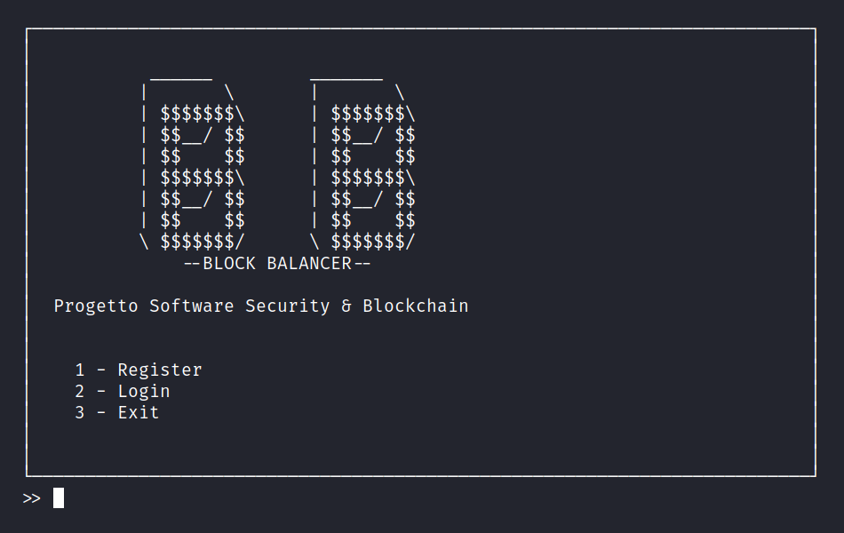
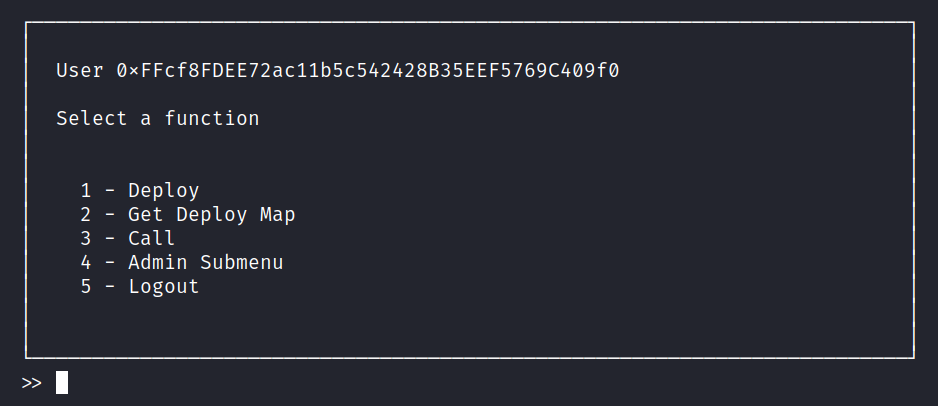
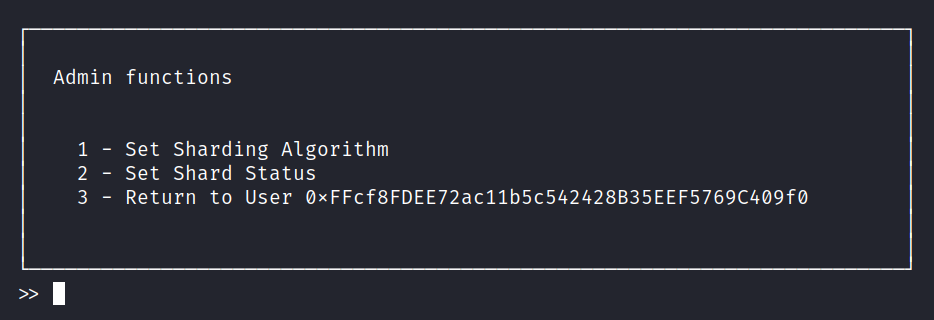

## Progetto Software Security & Blockchain
         ______         _______  
        |       \       |       \ 
        | $$$$$$$\      | $$$$$$$\
        | $$__/ $$      | $$__/ $$
        | $$    $$      | $$    $$
        | $$$$$$$\      | $$$$$$$\
        | $$__/ $$      | $$__/ $$
        | $$    $$      | $$    $$
        \ $$$$$$$/      \ $$$$$$$/

            --BLOCK BALANCER--

BlockBalancer é una dApp che implementa un prototipo di ***load balancer*** per gli ***smart contract*** deployati su un insieme di blockchain Ethereum.

## Guida all'utilizzo
Per utilizzare l'applicazione è necessario installare sul proprio sistema `docker` e `docker compose V2`. In caso di OS Windows occorre installare anche `wsl` (*Windows Subsystem for Linux*).

Clonare il repository con:
```
git clone https://github.com/Luigi-S/Progetto-software-security-e-blockchain.git
```

Posizionandosi nella cartella di progetto, eseguire `install.sh` per creare le immagini docker necessarie.

Nello stesso *path* è possibile eseguire gli script:
- `start.sh` per avviare l'applicazione
- `stop.sh` per chiudere l'applicazione
- `reset.sh` per cancellare lo stato dell'applicazione (account salvati, stato della blockchain, ABI dei contratti deployati)
- `uninstall.sh` per eliminare le immagini docker create (ma non le dipendenze)

In caso di OS Windows eseguire gli stessi *script* ma con estensione *.cmd*.

Potrebbe essere necessario abilitare l'*execute permission* degli script *bash* o eseguirli con ruolo di super-utente.

All'esecuzione del comando `./start.sh` si accede al terminale del container *app*. Per avviare il *client* digitare il comando:

```
python main.py
```

All'avvio il *client* mostra la seguente schermata:



In questo menù è possibile registrare un nuovo account *ethereum* o effettuare il *login* con un *account* già esistente.

L'utente autenticato può navigare nel seguente menù:



per deployare uno *smart contract*, visualizzare la mappa dei *deployments*, chiamare i metodi di uno *smart contract* o accedere alle funzionalità *admin* raccolte nel seguente *submenu*:



Qui l'*admin*, ovvero l'*owner* del contratto *Manager*, può impostare un nuovo algoritmo di *sharding* o cambiare lo stato di disponibilità di una blockchain (shard). Gli utenti base possono ugualmente navigare in questo *submenu* ma l'invocazione delle *admin functions* risulterà in un errore.

Il file 'account.txt' lista tutti gli *account Ethereum* generati da *ganache* con un bilancio non nullo di ETH. In fase di registrazione occorre scegliere uno di questi *account* e immettere la relativa coppia *address* - *private key*. Il primo *account* della lista è l'amministratore.

La cartella '/app/sc' contiene alcuni *smart contract* di prova per fare il *deployment*; nella cartella '/app/abi' si trovano le ABI dei contratti deployati durante l'utilizzo dell'applicazione.

Dal terminale del container *app*,  nel *path* '/app', è possibile lanciare gli *unit test* con il comando:

```
python -W ignore -m unittest discover -s ./test -p '*TestSuite.py'
```

> **Attenzione!** I test alterano lo stato delle blockchain *ethereum* e dell'applicazione. Per ripristinarlo si consiglia di interrompere e successivamente resettare l'applicazione.

## Configurazione
I file `.env` e `config.env` presenti nella *root* di progetto contengono alcuni parametri di configurazione predefiniti per il sistema. Nel file `.env`:

- **BASE_PORT** (default: 10000, min: 1025) è la porta a partire dalla quale vengono istanziate le *blockchain*. La *blockchain* di gestione è in ascolto sulla porta BASE_PORT; gli *shard* sono in ascolto sulle porte successive 
- **PORTS** (default: 4, min: 2, max: 10) è il numero di porte occupate, ovvero il numero di *blockchain*
- **SOLC_VERSION** (default: 0.8.18) è la versione del compilatore Solidity
- **GANACHE_HOST** (default: ganaches) è il nome del *container* che ospita le *blockchain ganache*
- **PY_BACKEND_HOST** (default: py_backend) è il nome del *container* che ospita il *back-end* in Python
- **API_PORT** (default: 5000) è la porta del *web server* in Flask 

Nel file `config.env`:
- **POLL_INTERVAL** (default: 0.5) è l'intervallo di tempo in secondi tra due *polling* consecutivi delle nuove transazioni degli *shard*
- **ADMIN_ADDRESS** è l'address dell'utente amministratore
- **ADMIN_PK** è la chiave privata dell'utente amministratore

Se si desidera modificare i parametri di configurazione dell'applicazione occorre prestare attenzione ai seguenti vincoli:

1. vincoli sul tipo e la forma dei parametri
2. i parametri **BASE_PORT** e **PORTS** devono essere tali che BASE_PORT + PORTS $\leq$ 65535
3. **ADMIN_ADDRESS** e **ADMIN_PK** devono riferirsi a un account *ethereum* valido generato da *ganache*, cioè presente in 'accounts.txt'

In caso di parametri malformati verrà generato un errore.

## Contributors
#### Christopher Buratti - Matteo Cirilli - Alessio Paolucci - Vito Scaraggi - Luigi Smargiassi