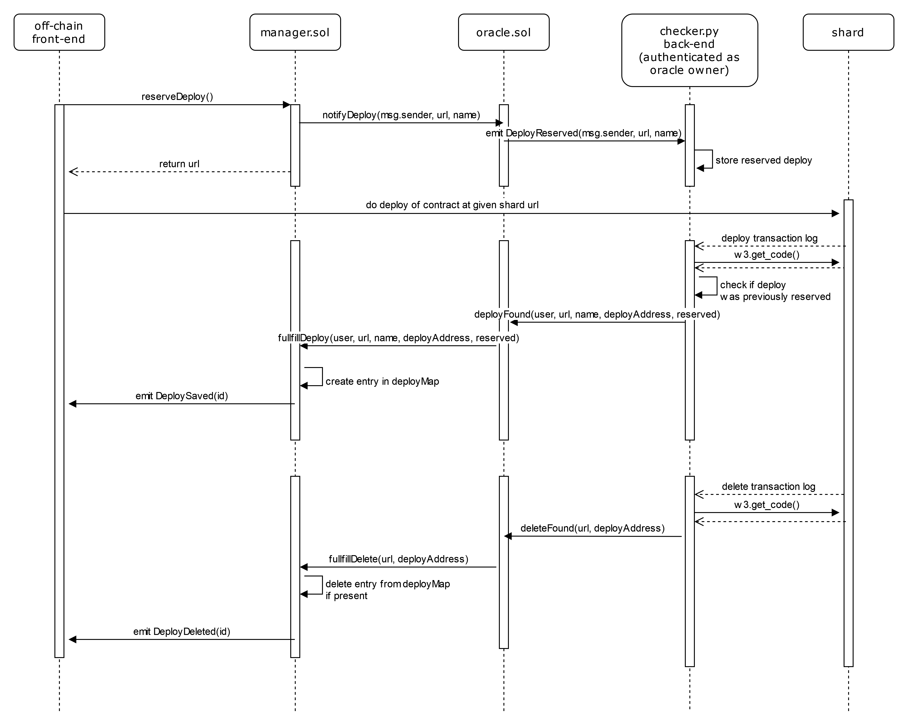

# Progetto Software Security & Blockchain

## Guida all'uso (Linux)
Installare docker e docker-compose.
Posizionarsi nella cartella di progetto ed eseguire da terminale i comandi:
>sudo docker-compose up
>
La variabile d'ambiente PORTS indica il numero di ganache rpc server e dev'essere un numero compreso tra 2 e 10 (default 4). I ganache rpc server sono in ascolto sulle porte 10000-1000x della macchina locale, dove x = PORTS-1.

## Architettura (update)
